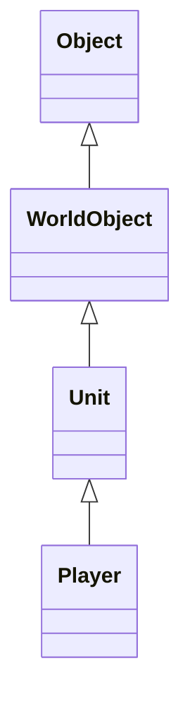

# 对象系统（v0.2）

## 类图

## 设计目的

- Object 提供唯一 GUID。
- WorldObject 增加世界坐标。
- Unit 抽象所有可战斗实体。
- Player 继承 Unit，拥有生命值能力。

## 与 TrinityCore 的对应

| MiniTrinityCore | TrinityCore |
|-----------------|-------------|
| Object          | Object      |
| WorldObject     | WorldObject |
| Unit            | Unit        |
| Player          | Player      |